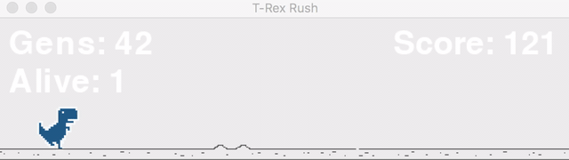

# NEAT-Dino-Game
This project is coded in Python utilizing the python-neat module in python. The AI learns how to play the Google Dino game: this involves learning when to duck, when to jump, and when to do nothing (this took me a long time till I realized there were actually three outputs not two). 

# Watch it in Action


# Inspiration
This project was inspired by my desire to learn more about machine learning and artificial intelligence and combining the two to create something fun. 

# Installation 
To see the dino teach itself how to play the game download/clone the repo and run python3 dino_game.py. Make sure to have python-neat and pygame installed. Using: 

```
pip install python-neat #to install python-neat 
pip install pygame #to install pygame 
python3 dino_game.py #to run game 
```

# Acknowledgment 
Some of the code for the game was modified and adapted from: https://github.com/shivamshekhar/Chrome-T-Rex-Rush.
The project was inspired from Tech with Tim's verison on using python-neat on Flappy Bird, you can check that out here: 
https://github.com/techwithtim/NEAT-Flappy-Bird/blob/master/flappy_bird.py. 
